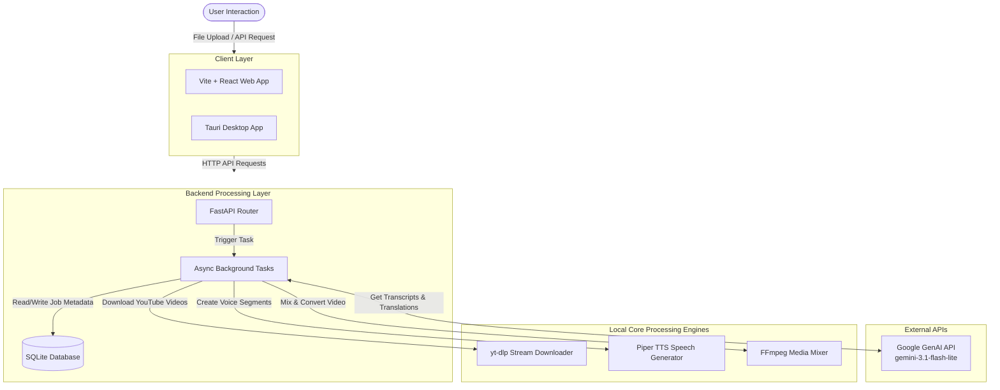

# EchoX — AI Video Translator & Dubbing Suite

> Translate videos into other languages while keeping the original speech speed and timing.

EchoX is a video translation and dubbing application. It automatically transcribes, translates, and adds new voiceovers to video and audio files. It uses the Gemini API to transcribe and translate the speech, and uses offline Piper TTS neural voices to generate the new spoken audio. The final output has timed voiceovers and subtitles in multiple languages.

---

## Overview

Translating videos into different languages is usually a slow and expensive process done by hand. EchoX makes this easy by automating the whole process. You can upload a video file or paste a YouTube link. EchoX will then extract the audio, convert the speech to text, translate it, and generate a new voice track in the target language.

EchoX keeps the speaker's speed and timing correct by adjusting the voiceover speed automatically so it matches the original video. This is useful for:
* **Creators and Teachers**: Translating lectures and tutorials to reach viewers worldwide.
* **Marketers**: Quickly translating product demos and social media videos.
* **Translation Teams**: Speeding up video and audio translation work.

---

## Key Features

### Web App
* **Easy Uploads**: Drag and drop video or audio files up to 200MB.
* **YouTube Support**: Paste a YouTube link to download and translate it automatically.
* **Polish Design**: Custom dropdowns that show upcoming languages but keep them disabled until they are ready.
* **Smooth Visuals**: Sleek layout with hover effects, glass-like inputs, and clean text selection highlights.

### Desktop App
* **Lightweight Tauri App**: Small file size (under 30MB) compared to normal 150MB+ Electron apps.
* **Local History**: Saves your previous translation jobs offline in a local SQLite database.
* **Live Logs**: Shows backend events and console status updates in real-time.
* **Simple Sidebar**: Clean sidebar layout to change settings and navigate the app.

### Core Translation Pipeline
* **Single-Step AI Processing**: Uploads audio to the Gemini API to get both transcription and translation in one step.
* **Offline Voice Generation**: Uses Piper TTS ONNX models to speak the translated text locally without needing internet.
* **Keep Background Sounds**: Uses FFmpeg to mix the new voice track while keeping the original video's music and sound effects playing softly in the background.
* **Fast Video Streaming**: Splits the output video into small segments (HLS) so it plays instantly in the browser without buffering.

---

## Architecture

EchoX uses a client-server structure. The frontend (Vite + React Web App or Tauri Desktop App) sends requests to the FastAPI Python Backend. The backend runs heavy tasks like audio extraction and translation in the background.



---

## Technology Stack

### Frontend
| Technology | Version | Purpose |
| :--- | :--- | :--- |
| **React** | `^19.2.5` | UI Component library |
| **Vite** | `^8.0.10` | Fast development server and build tool |
| **Tailwind CSS** | `^4.2.4` | CSS styling library |
| **Framer Motion** | `^12.39.0`| Page transitions and hover animations |
| **GSAP** | `^3.15.0` | Scroll animations and text reveals |
| **Lucide React** | `^1.14.0` | Vector icons |

### Backend
| Technology | Version | Purpose |
| :--- | :--- | :--- |
| **FastAPI** | `^0.115.0` | Python web framework |
| **Pydantic** | `^2.10.0` | Data checking and cleanup |
| **SQLAlchemy** | `^2.0.0` | Python database manager |
| **Aiosqlite** | `^0.20.0` | Async SQLite database driver |
| **Uvicorn** | `^0.34.0` | Web server |

### Desktop
| Technology | Version | Purpose |
| :--- | :--- | :--- |
| **Tauri** | `^2.0.0` | Rust wrapper to build lightweight desktop apps |
| **TypeScript** | `~5.8.3` | Type-safe JavaScript |
| **Reqwest** | `^0.12` | Rust HTTP client to talk to the backend |
| **Tokio** | `^1.0` | Async Rust runtime |

### AI / Machine Learning
| Technology | Version | Purpose |
| :--- | :--- | :--- |
| **Google GenAI SDK**| `^0.1.0` | Python client library for Gemini |
| **Piper TTS** | `^1.2.0` | Local speech generator (ONNX) |
| **Gemini Flash Lite**| `3.1` | Audio transcription and translation model |

### Other Tools
| Tool | Purpose |
| :--- | :--- |
| **FFmpeg** | Extracts audio, mixes voice tracks, and cuts video into streaming segments |
| **yt-dlp** | Downloads video streams from YouTube |
| **Vercel** | Hosts the web frontend |
| **Docker** | Packages the Python backend to run anywhere |

---

## Project Folder Structure

```
ai_video_translator/
├── backend/                  # FastAPI Python backend
│   ├── api/                  # API endpoints and routes
│   ├── core/                 # App configurations and database setup
│   ├── models/               # Database tables and Piper ONNX voice models
│   ├── services/             # Core logic (AI translation, FFmpeg commands)
│   ├── workers/              # Background task runner loops
│   ├── main.py               # Main backend entry point
│   └── Dockerfile            # Docker image configuration
├── frontend/                 # React Web frontend
│   ├── public/               # Static images and icons
│   ├── src/                  # React views, styles, and components
│   └── vercel.json           # Vercel routing configuration
├── EchoXDesktop/             # Tauri desktop wrapper
│   ├── src-tauri/            # Rust backend logic for Tauri
│   ├── src/                  # React desktop view components
│   └── tauri.conf.json       # Tauri app configuration
└── docker-compose.yml        # Setup to run backend container locally
```

---

## AI Translation Steps

The translation and dubbing process runs in the background on the server:

```
[User Input] ──> [Extract Audio] ──> [AI Translate] ──> [Generate Voice] ──> [Mix & Export]
```

### 1. Extract Audio
* **YouTube**: `yt-dlp` extracts the video and audio streams directly.
* **Files**: If you upload a video file, FFmpeg extracts the sound into a high-quality WAV audio file.

### 2. Speech Transcription & Translation
* The audio file is sent to the Gemini API.
* In a single query, `gemini-3.1-flash-lite` transcribes the audio, translates it, and splits it into timed segments.
* The API returns clean JSON data with start/end times and the translated text.

### 3. Subtitles
* The backend saves the timed segments into **SRT** and **WebVTT** subtitle files.

### 4. Generate Voice (Offline TTS)
* **Piper** reads each translated text segment aloud. It uses local voice models:
  * English: `en_US-lessac-medium.onnx`
  * Hindi: `hi_IN-rohan-medium.onnx`
  * Telugu: `te_IN-maya-medium.onnx`
* FFmpeg stretches or compresses the generated audio segments so they match the original speaker's start and end times.

### 5. Mix & Export Video
* The new voice segments are put together into a single audio track.
* If enabled, the original background sounds (like music and ambient noise) are mixed back in at a lower volume.
* The final audio is merged with the video.
* FFmpeg saves the final output as an MP4 file, and splits it into HLS segments for fast streaming in the web browser.

---

## Installation

### What You Need
* **Python**: `3.10` or higher
* **Node.js**: `18.x` or higher
* **FFmpeg**: Installed and added to your system path (needed to process audio and video)
* **Rust**: `1.75` or higher (only needed to build the desktop Tauri app)

### Backend Setup
1. Open the backend folder:
   ```bash
   cd backend
   ```
2. Create a virtual environment and install packages:
   ```bash
   python -m venv venv
   source venv/bin/activate  # On Windows: .\venv\Scripts\activate
   pip install -r requirements.txt
   ```
3. Create a `.env` file (see the Configuration section below) and set your `GEMINI_API_KEY`.
4. Start the server:
   ```bash
   uvicorn main:app --reload --port 8000
   ```

### Frontend Setup
1. Open the frontend folder:
   ```bash
   cd frontend
   ```
2. Install npm packages:
   ```bash
   npm install
   ```
3. Start the development server:
   ```bash
   npm run dev
   ```

### Desktop Setup
1. Open the desktop folder:
   ```bash
   cd EchoXDesktop
   ```
2. Install packages:
   ```bash
   npm install
   ```
3. Start Tauri in development mode:
   ```bash
   npm run tauri dev
   ```

---

## Configuration

### Backend Environment Variables (`backend/.env`)
Create a `.env` file inside the `backend/` folder:

```env
# Gemini Key
GEMINI_API_KEY=your_gemini_api_key_here

# Database URL
DATABASE_URL=sqlite+aiosqlite:///./translator.db

# Storage Folders
UPLOAD_DIR=./uploads
OUTPUT_DIR=./outputs
HLS_DIR=./hls

# App Settings
DEBUG=False
CORS_ORIGINS=["http://localhost:3000","http://localhost:5173","http://localhost"]
```

---

## API Routes

| Route | Method | Purpose |
| :--- | :--- | :--- |
| `/` | `GET` | Server status check |
| `/languages` | `GET` | List of supported languages |
| `/voices` | `GET` | Details on active voice models |
| `/upload` | `POST` | Upload video/audio file (returns a `job_id`) |
| `/translate-stream`| `POST` | Upload and trigger a dubbing job |
| `/translate` | `POST` | Trigger a dubbing job using a YouTube URL |
| `/progress/{job_id}`| `GET` | Get job status, progress percentage, and output URLs |
| `/stream/{job_id}` | `GET` | Stream video using HLS (`playlist.m3u8`) |
| `/subtitles/{job_id}`| `GET` | Download subtitle files (WebVTT or SRT) |
| `/download/{job_id}`| `GET` | Download the completed MP4 video |

---

## Deployment

### Frontend (Web App)
* Hosted on **Vercel**. It uses routing rules to redirect all clean subpaths (like `/features` or `/docs`) back to `index.html` so client-side routing works smoothly.

### Backend
* Packaged as a **Docker** container. It runs on cloud servers with process managers to start up automatically on reboot.

### Desktop Client
* Compiled into installer packages (Windows `.msi`, macOS `.app`, Linux `.deb`) using the Tauri CLI (`npm run tauri build`).

---

## Technical Implementations

* **Background Processing**: Media tasks run in background threads so they do not slow down web requests.
* **Lightweight Desktop wrapper**: Tauri uses native system web views, which saves memory compared to Electron.
* **Single-Query AI Pipeline**: The backend sends the audio file to the Gemini API to transcribe, translate, and segment it in a single pass.
* **Local Speech Synthesis**: Piper TTS runs locally, generating speech voices offline without third-party API costs.
* **Background Audio Mixing**: FFmpeg filters are used to blend original background tracks with newly synthesized voices.
* **Smooth Video Streaming**: Video outputs are split into HLS stream segments for immediate playback.
