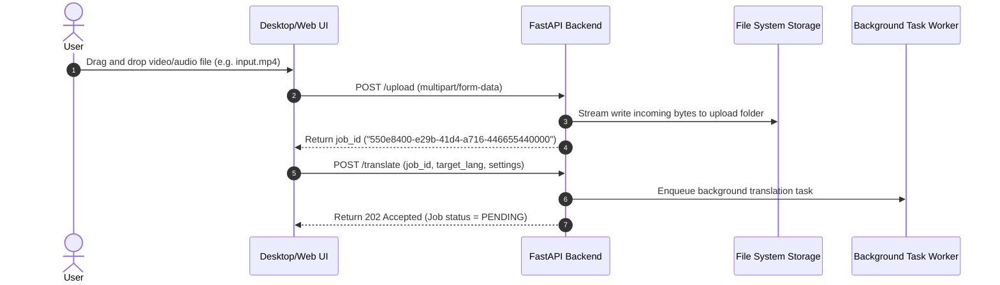
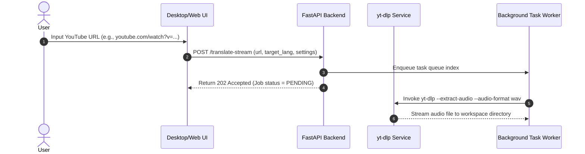
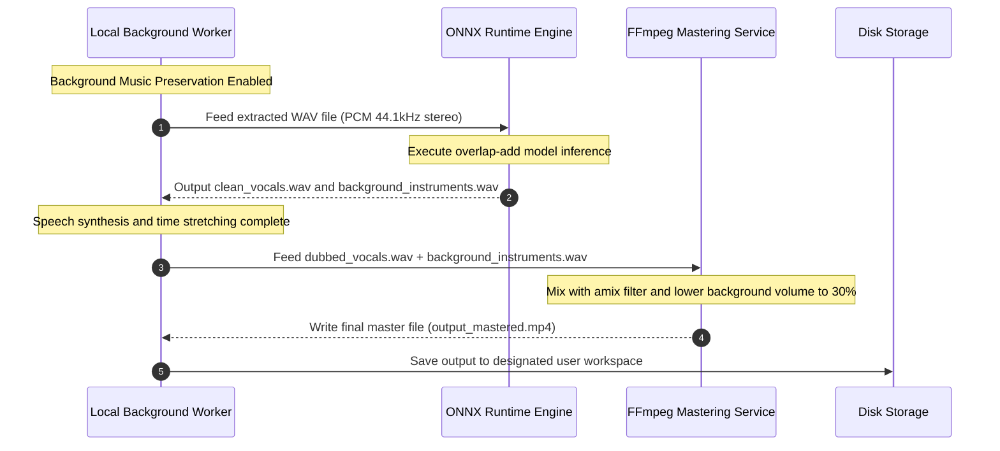
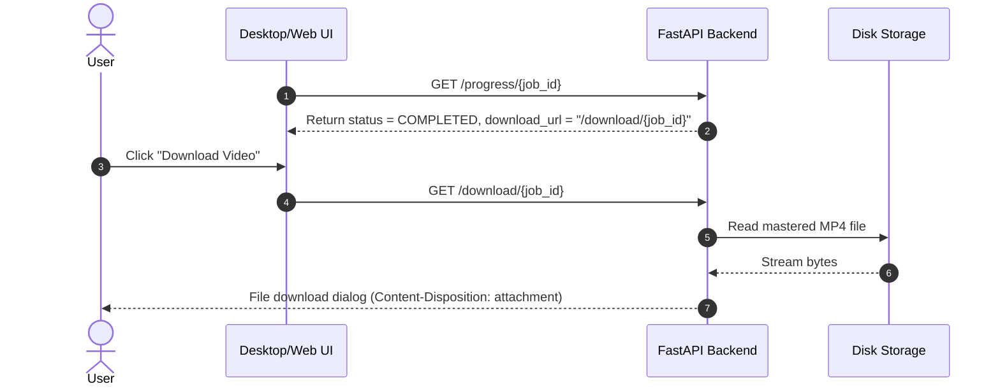
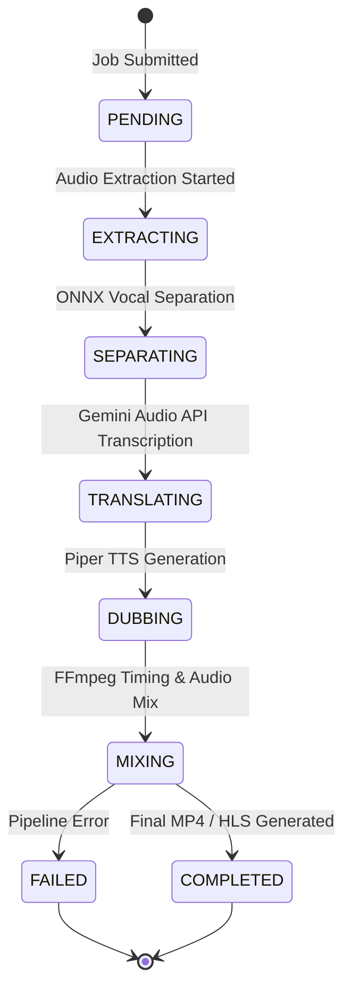

# EchoX System Design & Engineering Handbook

This document is a technical system design reference for the EchoX AI Video Translator & Dubbing Suite. It details the system architecture, pipelines, performance tradeoffs, design history, and engineering challenges.

---

## 1. Executive System Overview

EchoX is a client-server media dubbing system that automates the translation of vocal audio track elements while preserving original audio pacing, timeline synchronization, and optional background instrumentals.

### Functional Core
1. **Source Ingestion**: Accepts local video/audio uploads (up to 200MB) or downloads streams from video sharing platforms via `yt-dlp`.
2. **Dialogue Separation**: Isolates original vocal tracks from background audio. On desktop, this runs locally using Demucs-based ONNX models.
3. **Timed Translation**: Transcribes and translates the extracted vocals in a single API pass via `gemini-1.5-flash`, returning millisecond-accurate time boundaries.
4. **Speech Generation (Offline TTS)**: Synthesizes translated vocal segments using Piper TTS running local ONNX models.
5. **Timeline Pacing Alignment**: Dynamically stretches or compresses synthesized TTS clips using FFmpeg's `atempo` filter to align them with the original video's timeline.
6. **Composite Mastering**: Mixes the new speech with the separated background track and outputs an MP4 file or an HLS playlist.

---

## 2. Complete System Architecture

EchoX uses a client-server architecture. The clients (Web client or local desktop Tauri wrapper) communicate with a FastAPI Python backend server.

```mermaid
graph TB
  subgraph Client Layer
    WebClient[Vite + React Web Client]
    TauriApp[Tauri Desktop App]
  end

  subgraph Tauri Core (Rust Desktop)
    RustApp[Rust Tauri Core Bridge]
    LocalSQLite[(Local SQLite App History)]
    TauriApp <--> |IPC Command Invocation| RustApp
    RustApp <--> |SQLx Engine| LocalSQLite
  end

  subgraph Backend Service Layer (FastAPI)
    Router[FastAPI Controller Router]
    Worker[Async Celery/Background Worker]
    BackendDB[(Backend SQLite Database)]
    Router --> |Push Task to Queue| Worker
    Worker <--> |SQLAlchemy ORM| BackendDB
  end

  subgraph Media & Processing Engines
    ONNX[ONNX Runtime / Demucs Model]
    Piper[Piper TTS Engine]
    FFmpeg[FFmpeg Media Filter Pipeline]
    YTDLP[yt-dlp Stream Downloader]
  end

  subgraph External AI Services
    Gemini[Gemini 1.5 Flash API]
  end

  WebClient --> |HTTP API Requests| Router
  TauriApp --> |HTTP API Requests| Router
  Worker <--> Gemini
  Worker --> YTDLP
  Worker --> ONNX
  Worker --> Piper
  Worker --> FFmpeg
```

### Desktop ↔ Backend Interaction Scenarios

#### 1. Video and Audio File Upload Flow


#### 2. Streaming URL Ingestion Flow


#### 3. Local Background Preservation & Mastering Flow (Desktop)


#### 4. Download Outputs Flow


---

## 3. Detailed Translation Pipeline



### Step-by-Step Pipeline Mechanics
1. **Extraction**: Extract audio from source video to high-fidelity WAV (`pcm_s16le`, `16kHz`, mono).
2. **Background Separation**: In desktop modes, run local Demucs separation via ONNX Runtime to isolate background tracks.
3. **Gemini Ingestion**: Upload mono vocals to `gemini-1.5-flash`. The prompt instructs the model to act as a transcription and translation engine, outputting a timed subtitle schema in a single pass.
4. **Subtitles Creation**: Save time-stamped JSON data directly to WebVTT and SRT formats.
5. **Speech Generation**: Feed translated segments to local Piper TTS ONNX models to produce separate audio files.
6. **Speed Matching**: Stretch the duration of generated audio files using FFmpeg's `atempo` filter to align them with original timing boundaries.
7. **Mastering & Streaming**: Mix dubbed audio with background audio and encode the output as a web-compatible MP4 file or HLS segment playlists.

---

## 4. Engineering Technology Decisions

### Web and Desktop UI (React)
* **Advantages**: Declarative component syntax and efficient virtual DOM updates.
* **Tradeoffs**: Standard DOM reconciliation overhead. Addressed by isolating animation logic in canvas elements and optimizing layout properties.
* **Rejected Alternatives**: 
  * *Vanilla JS*: Hard to maintain across complex state changes (e.g., streaming status feeds).
  * *Vue.js*: Less ecosystem support for Tauri-based wrapper components.

### Backend Application Framework (FastAPI)
* **Advantages**: Fast async performance, native Pydantic data validation, and automatic OpenAPI schema generation.
* **Tradeoffs**: Requires careful management of event loops when calling heavy synchronous CLI tools like FFmpeg.
* **Rejected Alternatives**: 
  * *Django*: Too heavy, and its synchronous database defaults complicate real-time processing tasks.
  * *Flask*: Lacks built-in async features and requires manual validation libraries.

### Database System (SQLite)
* **Advantages**: Serverless, zero configuration, single-file storage, and high-speed local processing.
* **Tradeoffs**: Limited write concurrency (writes lock the file). We address this by running in Write-Ahead Logging (WAL) mode.
* **Rejected Alternatives**: 
  * *PostgreSQL*: Unnecessary system overhead for desktop installations.
  * *MongoDB*: Schemaless features are not required for our structured, relational schema.

### Desktop Wrapper (Tauri instead of Electron)
* **Advantages**: Lightweight executables (under 30MB), uses native OS WebViews (WebView2/WebKit), low RAM usage, and a secure Rust system interface.
* **Tradeoffs**: Relies on system-installed browser engines, which can introduce minor rendering variations across operating systems.
* **Rejected Alternatives**: 
  * *Electron*: High memory overhead (150MB+ idle) and large bundle sizes due to packaging Chromium.

### Speech Engine (Piper TTS instead of Cloud TTS APIs)
* **Advantages**: High-quality neural speech output, runs completely offline, incurs no per-character API costs, and supports low-latency CPU processing.
* **Tradeoffs**: Requires downloading and caching large voice model files locally.
* **Rejected Alternatives**: 
  * *ElevenLabs / Google Cloud TTS*: High operating costs and requires an active internet connection.

### Audio Translation Model (Gemini 1.5 Flash instead of Whispering + GPT-4)
* **Advantages**: Native audio processing reduces transcription errors, and its large context window allows transcribing, translating, and segmenting audio in a single query.
* **Tradeoffs**: Requires internet connectivity for API calls.
* **Rejected Alternatives**: 
  * *Whisper Local + GPT-4*: Slower execution speed and higher resource requirements when run locally.

---

## 5. Architectural Evolution

```
[Initial Build] ────────> [Desktop Build] ────────> [ONNX Separation] ────────> [Unified Piper Engine]
Cloud-only backend       Tauri Rust wrapper         Vocal extraction           Standardized local models
Capped API mixing        Local SQLite history       Local ONNX Runtime        Dual light/dark player widgets
```

### Milestones
1. **Initial Cloud Pipeline**: Relying entirely on cloud APIs made background music preservation difficult, often leading to muted backing tracks.
2. **Desktop Integration**: Added Tauri to manage local assets and processing pipelines.
3. **ONNX Runtime Migration**: Migrated from PyInstaller wrappers to native ONNX Runtime using the `microsoft.ml.onnxruntime.directml.1.24.4` package for hardware-accelerated local audio separation.
4. **CPU-Only Separation Engine**: Migrated to CPU-only separation pipelines to avoid GPU driver issues and DirectML dependency crashes.
5. **Standardized Local Piper Engine**: Consolidated and cached local Piper ONNX voices, using lightweight player widgets to play generated previews.

---

## 6. Engineering Challenges & Troubleshooting

### 1. ONNX Runtime & DirectML Version Mismatches
* **Symptom**: Application crashes with status code `0xc0000005` (Access Violation) when running separation tasks.
* **Root Cause**: Incompatibilities between the DirectML backend DLLs and host GPU drivers under the `microsoft.ml.onnxruntime.directml.1.24.4` package.
* **Solution**: Swapped the GPU-accelerated DirectML session providers for a CPU execution pipeline.
* **Lessons Learned**: For consumer desktop apps, CPU fallback engines provide more reliable deployment across varying hardware configurations.

### 2. Audio Processing Clicking & Overlap Artifacts
* **Symptom**: Audible clicking sounds at the boundaries of processed audio chunks.
* **Root Cause**: Processing 10-second chunks independently created phase mismatches at boundary seams.
* **Solution**: Implemented an overlap-add reconstruction window. Chunks are extracted with a 1-second overlap, processed, and blended back together using a linear fade.
* **Lessons Learned**: Overlapping audio processing is essential to prevent boundary artifacts in sliding window models.

### 3. Nested ZIP Archive Extraction Errors
* **Symptom**: Voice downloads fail to load and throw directory errors.
* **Root Cause**: Compressed Piper model packages extracted into nested subfolders containing spaces in their names.
* **Solution**: Updated the model downloader to recursively extract nested archives and normalize output folder names.
* **Lessons Learned**: Always normalize folder paths and handle varying archive structures during automatic downloads.

---

## 7. Performance & Optimization

### Local Processing & Memory Tuning
* **Memory Limits**: Restricting local ONNX separation to 10-second chunks keeps RAM usage under 1.2GB, allowing the app to run on low-end systems.
* **Dynamic Model Offloading**: Unloads Piper and separation models from system memory after 10 minutes of inactivity.

### Visualizer Optimization
* **CSS ScaleY Animations**: Replaced height-based visualizer animations with GPU-accelerated `transform: scaleY` rules. This avoids browser layout recalculations and keeps the visualizer running at 60 FPS.

