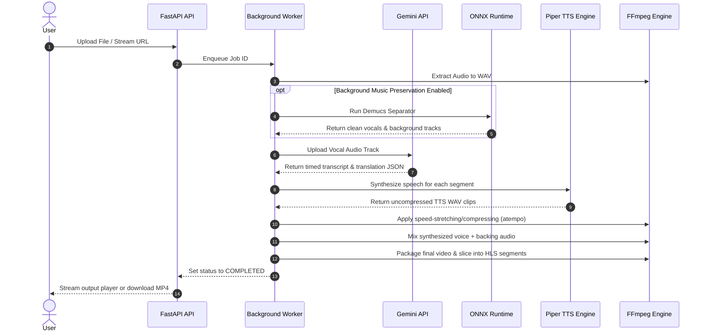
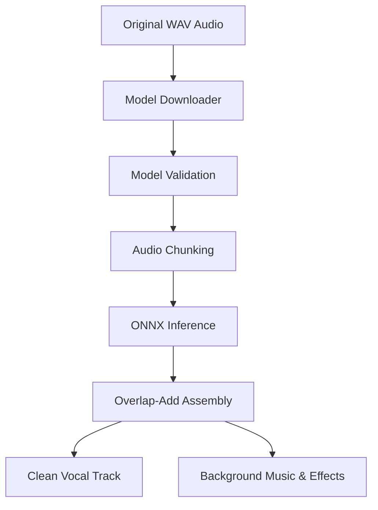
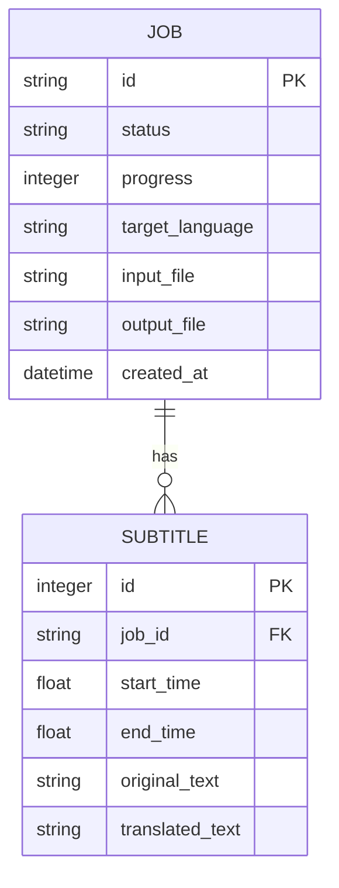
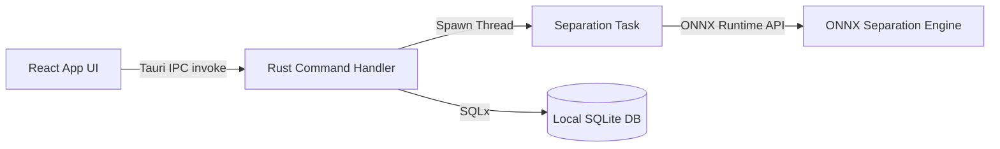

# EchoX Technical Documentation

This document serves as a complete technical reference for developers working on the EchoX AI Video Translator & Dubbing Suite. It details the internal systems, audio pipelines, machine learning models, database structures, and platform architectures of EchoX.

---

## 1. Project Overview

EchoX is a pipeline-driven media translator that automates the transcription, translation, and dubbing of video and audio streams. 

Internally, EchoX converts multi-channel audio tracks into single-channel vocal audio, transcribes the speech with segment-level timestamps using Gemini, generates target-language speech using offline neural Piper TTS ONNX models, speed-stretches the generated speech to match original timestamps, separates ambient sounds/background music using ONNX-based source separation, and mixes a final output track using FFmpeg filters.

---

## 2. Complete System Architecture

EchoX uses a client-server pattern. The clients connect to a FastAPI Python backend. On desktop systems, Tauri runs a local client wrapper that communicates with the local/remote backend instance.

```mermaid
graph TB
  subgraph Client Layer
    WebClient[React Web Client]
    TauriApp[Tauri Desktop App]
  end

  subgraph Tauri Core (Desktop)
    RustApp[Rust Tauri Core]
    LocalDB[(SQLite Local DB)]
    TauriApp <--> |IPC Commands| RustApp
    RustApp <--> |SQLx Queries| LocalDB
  end

  subgraph Backend Service Layer (FastAPI)
    Router[FastAPI API Router]
    Worker[Async Task Worker]
    BackendDB[(SQLite Backend DB)]
    Router --> |Enqueue Job| Worker
    Worker <--> |SQLAlchemy| BackendDB
  end

  subgraph Local Engines
    ONNX[ONNX Runtime / Demucs]
    Piper[Piper TTS Speech Engine]
    FFmpeg[FFmpeg Media Engine]
    YTDLP[yt-dlp Downloader]
  end

  subgraph External AI Services
    Gemini[Gemini 1.5 Flash API]
  end

  WebClient --> |HTTP / REST| Router
  TauriApp --> |HTTP / REST| Router
  Worker <--> Gemini
  Worker --> YTDLP
  Worker --> ONNX
  Worker --> Piper
  Worker --> FFmpeg
```

### Components and Responsibilities
* **Web Frontend (React/Vite)**: Responsive single-page application hosted on Vercel. Includes interactive player widgets.
* **Desktop Frontend (React/Tauri)**: Native client container. Interacts with local OS APIs, manages IPC requests, and triggers Tauri Rust backend commands.
* **FastAPI Backend**: Orchestrates API requests, manages active job queues, and invokes workers.
* **SQLite (Backend & Local)**: Stores task records, processing histories, and settings.
* **Gemini 1.5 Flash**: Orchestrates single-query audio transcription, translation, and timed segment extraction.
* **Piper TTS**: Performs fast, offline neural speech synthesis using ONNX models.
* **ONNX Runtime**: Executes CPU-based model inference for Demucs audio separation.
* **FFmpeg**: Handles audio extraction, audio speed-matching, mixing, and HLS streaming segment generation.
* **yt-dlp**: Extracts video streams from platform URLs.

---

## 3. Complete Translation Pipeline

The translation pipeline coordinates sequential stages from ingestion to final HLS delivery.



### Timeline Speed Matching
When Piper synthesizes a translated segment, the duration of the generated WAV clip rarely matches the original speaker's timeline duration. 
* **If the TTS clip is longer** than the original segment duration, FFmpeg applies the `atempo` filter to speed up the audio without shifting pitch.
* **If the TTS clip is shorter**, it is padded with silence or stretched down using `atempo` to ensure alignment.

---

## 4. Desktop Audio Separation Pipeline

On desktop, EchoX executes local offline audio source separation to split vocal dialogue from background tracks.



### Desktop Pipeline Details
1. **Automatic Model Downloader**: Downloads the Demucs ONNX vocal-instrumental separation model to local storage.
2. **Model Validation**: Computes MD5 checksum hashes to ensure the downloaded model matches expected tensors.
3. **Dynamic Runtime Loading**: Loads the `.onnx` model into the ONNX Runtime session using CPU execution providers.
4. **Audio Chunking**: Splits large audio tracks into smaller chunks (typically 10-second segments) to manage RAM usage.
5. **Overlap-Add Processing**: Chunks are extracted with a 1-second overlap. The model processes each chunk, and overlap-add reconstruction blends the borders using a linear fade to avoid clicking sounds.
6. **Vocal Extraction & Reconstruction**: Separates the source audio into a clean vocal track and a reconstructed backing track (background music and effects).

---

## 5. Backend Pipeline & Services

Every backend service inside `backend/services/` operates asynchronously:

* **Translation Pipeline Service**: Orchestrates the job state machine, updating status fields from `PENDING` -> `EXTRACTING` -> `TRANSLATING` -> `DUBBING` -> `MIXING` -> `COMPLETED`.
* **Download Service**: Wraps `yt-dlp` to download streaming videos and write streams directly to file descriptors.
* **Gemini Audio Service**: Handles audio chunk uploads, API requests, and JSON transcript parsing.
* **Piper Dubbing Service**: Feeds translated text segments to the local Piper process and manages temporal speed-matching ratios.
* **FFmpeg Mixing Service**: Automatically executes multi-filter audio graphs to merge audio tracks.
* **Cleanup Daemon Worker**: Automatically runs every hour to remove files older than 24 hours.

---

## 6. AI Models

### 1. Gemini 1.5 Flash (`gemini-1.5-flash`)
* **Purpose**: Performs simultaneous audio transcription, translation, and time-stamped segmentation in a single step.
* **Input**: Single-channel 16kHz vocal WAV audio.
* **Output**: JSON array containing structured objects:
  ```json
  [
    {
      "start": 0.5,
      "end": 2.8,
      "original": "Hello, how are you?",
      "translated": "Bonjour, comment allez-vous?"
    }
  ]
  ```
* **Why Chosen**: Large context window, native audio understanding, and low API latency.

### 2. Piper TTS Models
* **Supported Languages**: English, Hindi, Telugu, Malayalam, Urdu, Spanish, French, German, Italian, Portuguese, Chinese, Russian, Arabic, Turkish, Indonesian, Vietnamese, Dutch, Polish.
* **Model Format**: `.onnx` model file + `.json` voice metadata profile file.
* **Default Voices**:
  * English: `en_US-lessac-medium` (Male)
  * Hindi: `hi_IN-rohan-medium` (Male)
  * Telugu: `te_IN-maya-medium` (Female)

### 3. Demucs ONNX Separation Model
* **Input Tensor**: `[1, 2, N]` (stereo audio samples, where N is chunk size).
* **Output Tensors**: Vocals `[1, 2, N]`, Instruments `[1, 2, N]`.
* **Sample Rate**: 44.1kHz.
* **Overlap Size**: 1 second.
* **Chunk Size**: 10 seconds.

---

## 7. Audio Processing & FFmpeg Command Reference

### 1. Extract Audio from Video
Converts video to a high-quality single-channel 16kHz WAV track for Gemini:
```bash
ffmpeg -y -i input.mp4 -vn -acodec pcm_s16le -ar 16000 -ac 1 output_vocals.wav
```

### 2. Audio Speed-Matching (Time Stretch)
Compresses a 5-second audio clip to fit a 4-second time segment (speed factor 1.25):
```bash
ffmpeg -y -i clip.wav -filter:a "atempo=1.25" output_stretched.wav
```

### 3. Background Preservation & Audio Mixing
Combines the synthesized voice track (channel 0) with the instrumental/background track (channel 1), reducing background volume to 30%:
```bash
ffmpeg -y -i voice.wav -i backing.wav -filter_complex "[1:a]volume=0.3[bg];[0:a][bg]amix=inputs=2:duration=first[out]" -map [out] mixed_output.wav
```

### 4. HLS Segment Slicing
Converts the completed video into streaming HLS files:
```bash
ffmpeg -y -i output.mp4 -profile:v baseline -level 3.0 -s 640x360 -start_number 0 -hls_time 6 -hls_list_size 0 -f hls playlist.m3u8
```

---

## 8. Database Schema

EchoX database schemas are managed through SQLAlchemy.



### Differences: Desktop SQLite vs. Backend SQLite
* **Backend SQLite**: Designed for concurrency, uses SQLAlchemy `aiosqlite` async drivers, and runs in write-ahead logging (WAL) mode to track translation queues.
* **Desktop SQLite**: Leverages local Rust Tauri structures. Saves histories, saves app settings locally (e.g., target directories, preferred languages), and does not require async task concurrency locks.

---

## 9. API Documentation

### 1. Upload Media File
* **Endpoint**: `POST /upload`
* **Request**: Multipart Form Data (`file: UploadFile`).
* **Response (`202 Accepted`)**:
  ```json
  {
    "job_id": "8f2d93e1-cc42-498b-bd85-e117392a83bd",
    "status": "PENDING"
  }
  ```

### 2. Translate Stream URL
* **Endpoint**: `POST /translate-stream`
* **Request**: JSON Body:
  ```json
  {
    "url": "https://www.youtube.com/watch?v=example",
    "language": "te"
  }
  ```
* **Response (`202 Accepted`)**:
  ```json
  {
    "job_id": "8f2d93e1-cc42-498b-bd85-e117392a83bd",
    "status": "PENDING"
  }
  ```

### 3. Get Job Progress
* **Endpoint**: `GET /progress/{job_id}`
* **Response (`200 OK`)**:
  ```json
  {
    "job_id": "8f2d93e1-cc42-498b-bd85-e117392a83bd",
    "status": "MIXING",
    "progress": 85,
    "error": null,
    "output_url": "/download/8f2d93e1-cc42-498b-bd85-e117392a83bd"
  }
  ```

---

## 10. Directory Structure

```
ai_video_translator/
├── backend/
│   ├── api/                  # HTTP route definitions (uploads, progress, downloads)
│   ├── core/                 # SQLite setup, model configurations, path rules
│   ├── models/               # SQLAlchemy schema definitions
│   ├── services/             # Pipeline components (ONNX separation, Piper TTS, FFmpeg mixing)
│   └── workers/              # Async worker loop running background translation tasks
├── frontend/
│   ├── public/               # Static assets and voice previews
│   └── src/
│       ├── components/       # UI elements (VoicePlayer, LanguageSelector)
│       └── pages/            # Page layouts (HomePage, FeaturesPage, DocsPage)
└── EchoXDesktop/
    ├── src-tauri/
    │   └── src/              # Rust source (IPC commands, SQLite database connections)
    └── src/
        ├── components/       # Desktop UI components (VoiceSelect, HudMonitor)
        └── pages/            # Desktop page layouts (HistoryPage, SettingsPage)
```

---

## 11. Desktop Architecture



* **Tauri Wrapper**: Uses native Webview2 (Windows) or WebKit (macOS/Linux) to render the frontend.
* **IPC Bridge**: Tauri commands invoke local Rust functions for high-speed tasks (like reading database files, reading configuration paths, and verifying local files).
* **Model Storage**: ONNX and Piper models are stored inside the platform's App Data directory (`%APPDATA%/EchoX` on Windows, `~/.local/share/EchoX` on Linux).

---

## 12. Environment Configurations

| Variable Name | Default Value | Description |
| :--- | :--- | :--- |
| `GEMINI_API_KEY` | None (Required) | API Key used to authenticate translation tasks. |
| `DATABASE_URL` | `sqlite+aiosqlite:///./translator.db` | Path to backend database. |
| `UPLOAD_DIR` | `./uploads` | Directory for temporary raw video/audio uploads. |
| `OUTPUT_DIR` | `./outputs` | Directory for storing completed MP4 videos. |
| `HLS_DIR` | `./hls` | Directory for storing sliced streaming folders. |

---

## 13. Error Handling

* **Model Download Failures**: If a model download fails, EchoX retries up to three times before falling back to the default English voice model (`en_US-lessac-medium`).
* **Translation Failures**: If Gemini fails to return valid JSON, the pipeline retries the request. If it fails again, it falls back to raw translation paragraphs without timeline timestamps.
* **FFmpeg Mixing Failures**: If mixing fails (e.g. due to corrupted video tracks), the worker creates a fallback audio-only MP3 output containing the translated speech.

---

## 14. Performance

* **Model Caching**: Loaded models are kept in RAM during active jobs. If no jobs are received for 10 minutes, the worker unloads them to free system memory.
* **CPU Chunking**: Demucs processes 10-second segments sequentially, keeping desktop memory usage under 1.2GB during audio separation.
* **HLS Slicing**: Slicing outputs into 6-second segments allows the web browser to play videos instantly while the rest of the file continues processing in the background.

---

## 15. Security

* **API Keys**: Stored in a local `.env` file on the server. Never exposed to the client.
* **File Validation**: Uploaded files must match approved media MIME types (e.g. `video/mp4`, `audio/wav`).
* **Clean-Up Service**: The cleanup worker removes files older than 24 hours to prevent local storage depletion.

---

## 16. Web & Desktop Client-to-Backend Operations

### 1. Video and Audio File Ingestion Flow
* **Upload Stage**: The client sends a `POST /upload` request containing the multi-part file bytes. The backend streams these bytes directly into the local `uploads/` directory on the server disk.
* **Initiation Stage**: Once the file is uploaded, the client sends a `POST /translate` request with the returned `job_id`, specifying target language and mixing preferences. The backend enqueues a background job using task workers.
* **Polling Status**: The client periodically polls `GET /progress/{job_id}` to retrieve progress percentages and logs.

### 2. URL Stream Ingestion Flow
* **Initiation**: The client calls `POST /translate-stream` providing the streaming URL (e.g. YouTube).
* **Processing**: The backend worker triggers `yt-dlp` to extract the streams, writes them locally, and initiates the standard translation pipeline.

### 3. Local Background Preservation & Mixing (Tauri Desktop App)
* **Audio Separation**: When running separation locally on the desktop app, the host app calls local Tauri Rust command bridges to load the ONNX model, slice inputs into 10-second segments, run CPU inference, and reconstruct the channels.
* **Mastering**: The local Tauri app calls system-installed FFmpeg binaries to compress/speed-match the Piper audio, mix it back with separated background tracks, and output the final MP4.

### 4. Output Downloads
* **Delivery**: Upon progress reaching `COMPLETED`, the client makes a `GET /download/{job_id}` call. The backend reads the finalized MP4 from `outputs/` and streams the file payload back to the client.

